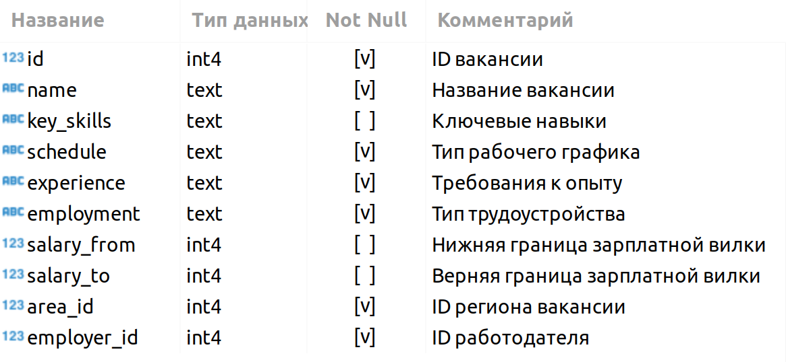

# Project 2. Анализ вакансий из Head Hunter

## Оглавление  
[1. Описание проекта](https://github.com/itbias/sf_data_science/edit/main/project_1/Readme.md#Описание-проекта)  
[2. Какой кейс решаем?](https://github.com/itbias/sf_data_science/edit/main/project_1/Readme.md#Какой-кейс-решаем)  
[3. Результаты](https://github.com/itbias/sf_data_science/edit/main/project_1/Readme.md#Результаты)    

### Описание проекта    
Провести анализ данных вакансий hh.ru.

### Этапы проекта    
1. Знакомство с данными
2. Предварительный анализ данных
3. Детальный анализ вакансий
4. Анализ работодателей

**Условия:**  
- Каждая часть состоит из блока практических заданий, которые необходимо выполнить в jupyter-ноутбуке.
- Ноутбук необходимо оформить на основе предоставленного шаблона и [требований](https://github.com/itbias/sf_data_science/edit/main/project_1/Readme.md#Требования-к-оформлению-ноутбука).
- Отправить свой код ментору для code-ревью. 

**Требования к оформлению ноутбука**     
- Решение оформляется только в Jupyter Notebook.
- Решение оформляется в соответствии с ноутбуком-шаблоном.
- Каждое задание выполняется в отдельной ячейке, выделенной под задание (в шаблоне они помечены как ваш код здесь). Не следует создавать много ячеек для решения задачи — это провоцирует неудобства при проверке.
- Текст SQL-запросов и код на Python должны быть читаемыми. Не забывайте про отступы в SQL-коде.
- Выводы по каждому этапу оформляются в формате Markdown в отдельной ячейке (в шаблоне они помечены как ваши выводы здесь).
- Выводы можно дополнительно проиллюстрировать с помощью графиков. Они оформляются в соответствии с теми правилами, которые мы приводили в модуле по визуализации данных.
- Не забудьте удалить ячейку с данными соединения перед фиксацией работы в GitHub.

### Знакомство с данными:  
Все необходимые таблицы находятся в схеме public базы данных project_sql (именно эту базу вам необходимо указать в параметре dbname при подключении).

То есть параметры подключения будут следующими:

- DBNAME = 'project_sql'
- USER = 'skillfactory'
- PASSWORD = 'cCkxxLVrDE8EbvjueeMedPKt'
- HOST = '84.201.134.129'
- PORT = 5432

Познакомимся с каждой таблицей.

VACANCIES

Таблица хранит в себе данные по вакансиям и содержит следующие столбцы:

Зарплатная вилка — это верхняя и нижняя граница оплаты труда в рублях (зарплаты в других валютах уже переведены в рубли). Соискателям она показывает, в каком диапазоне компания готова платить сотруднику на этой должности.

AREAS

Таблица-справочник, которая хранит код региона и его название.

EMPLOYERS

Таблица-справочник со списком работодателей.

INDUSTRIES

Таблица-справочник вариантов сфер деятельности работодателей.

EMPLOYERS_INDUSTRIES
Дополнительная таблица, которая существует для организации связи между работодателями и сферами их деятельности.

Эта таблица нужна нам, поскольку у одного работодателя может быть несколько сфер деятельности (или работодатели могут вовсе не указать их). Для удобства анализа необходимо хранить запись по каждой сфере каждого работодателя в отдельной строке таблицы.

### Результаты:  
[Ноутбук с выполненными заданиями и выводами](https://github.com/itbias/sf_data_science/blob/main/project_1/Project-1.ipynb)

:arrow_up:[к оглавлению](https://github.com/itbias/sf_data_science/edit/main/project_1/Readme.md#Оглавление)